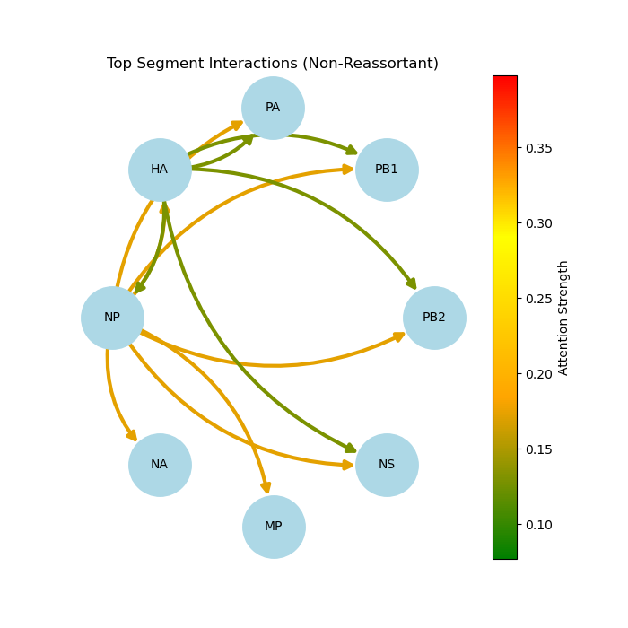
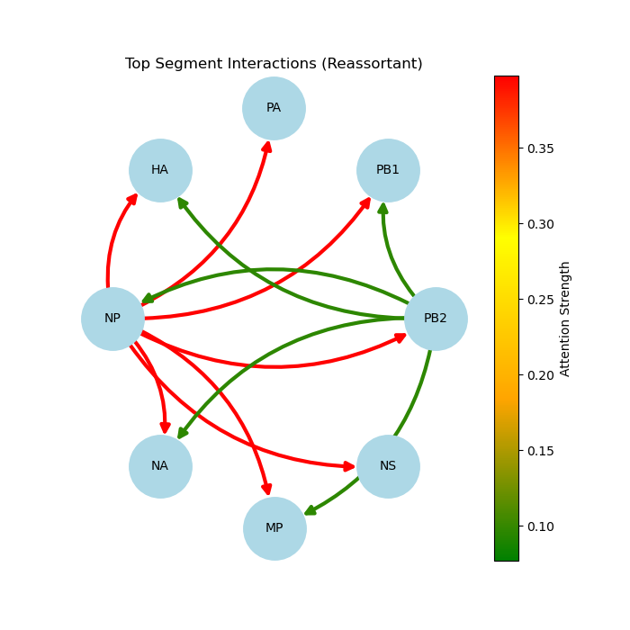

# Predicting Reassortment potential in Influenza A virus using foundation models (DNABERT2) and genetic algorithms

## Overview
This project presents an AI-driven framework for predicting Influenza A reassortment potential using foundation-model-derived genomic representations. Influenza genomes are processed segment-wise using DNABERT-2 embeddings, followed by a Random Forest classifier for reassortment prediction. 

In addition to classification, a Graph Attention Network (GAT) is used to model segment-level relationships and characterize attention-guided segment compatibility patterns associated with reassortment. A genetic algorithm module is used to explore biologically plausible reassortant candidates.

This work was accepted at the NeurIPS 2025 2nd Workshop on Foundation Models for Life Sciences (FM4LS).


## Why Reassortment Prediction Matters

Influenza A viruses have segmented genomes, which allows whole genome segments to be exchanged when two viruses co-infect the same host. This process, known as reassortment enables rapid viral evolution and generate novel viral genotypes with altered host range, transmissibility, or pandemic potential.

Early identification of reassortment signals is important for genomic surveillance, outbreak preparedness, and prioritizing high-risk viral combinations for downstream investigation.

## Methodology

The framework consists of four main components:

### 1. Segment-wise embedding generation

Each Influenza A genome is represented using its 8 genomic segments: PB2, PB1, PA, HA, NP, NA, MP, and NS. Each segment is processed independently through a foundation model (DNABERT-2) to generate segment-level embeddings. These embeddings are then concatenated to form a genome-level representation.

### 2. Reassortment classification

A Random Forest classifier is trained on concatenated DNABERT-2 segment embeddings to classify genomes as reassortant or non-reassortant.

### 3. Segment interaction analysis with GAT

Beyond the primary Random Forest classifier, a Graph Attention Network (GAT) is used to model segment-level relationships within each influenza genome. Each genome is represented as an 8-node graph corresponding to PB2, PB1, PA, HA, NP, NA, MP, and NS, enabling attention-guided characterization of segment compatibility patterns associated with reassortment.

### 4. Genetic Algorithm-Based Reassortant Candidate Generation

Influenza virus reassortment is not entirely random; it is shaped by factors such as host species, viral subtypes, and compatible segment combinations. The goal is to simulate reassortment by generating multiple potential reassortant genomes and evaluating them using the trained classifier to determine whether they qualify as reassortants or non-reassortants. 

## Dataset

This project uses Influenza A H5N1 genome sequences curated from published studies, with a focus on reassortant and non-reassortant viruses.

### Training and Model Development Dataset

Initial model development focused on H5N1 clade 2.3.4.4b sequences from the United States 2021–2022 outbreak period. The dataset includes both non-reassortant and reassortant genotypes.

#### Training Dataset

| Dataset component | Subtype and Clade | Genotype(s) | Class | Number of sequences | Use |
|---|---|---|---|---:|---|
| Training non-reassortants | H5N1 clade 2.3.4.4b | A1 | Non-reassortant | 120 | Training |
| Training reassortants | H5N1 clade 2.3.4.4b | B1.1, B1.2, B2, B3.1, B3.2, B4, B5 | Reassortant | 119 | Training |
| **Total** | — | — | — | **239** | Training |

#### Test Dataset 1 (Same Study)

| Dataset component | Source relationship | Subtype and Clade| Genotype(s) | Class | Number of sequences | Use |
|---|---|---|---|---|---:|---|
| Same-study non-reassortants | Same published study as training data, not used in training | H5N1 clade 2.3.4.4b | A2, A3 | Non-reassortant | 25 | Test |
| Same-study reassortants | Same published study as training data, not used in training | H5N1 clade 2.3.4.4b | Minor reassortant genotypes | Reassortant | 30 | Test |
| **Total** | — | — | — | — | **55** | Test |

#### Test Dataset 2 (External Study, includes other clades)

| Source | Subtype and Clade | Genotype | Class | Number of sequences |
|---|---|---|---|---:|
| Alaska 2022 dataset | H5N1 clade 2.3.4.4b | A4 | Non-reassortant | 6 |
| Bangladesh H5N1 study | H5N1 clade 2.3.2.1a | Unknown | Non-reassortant | 1 | 
| Vietnam clade distribution study | H5N1 clade 1.1.2 | VN3 | Non-reassortant | 7 | 
| Vietnam clade distribution study | H5N1 clade 2.3.2.1a | VN12 | Non-reassortant | 2 | 
| Vietnam clade distribution study | H5N1 clade 2.3.2.1b | VN45 | Non-reassortant | 1 | 
| Bangladesh H5N1 study | H5N1 clade 2.3.2.1a | Unknown | Reassortant | 5 | 
| **Total non-reassortants** | — | — | Non-reassortant | **17** | — |
| **Total reassortants** | — | — | Reassortant | **5** | — |
| **Total** | — | — | — | **22** | External-study test collection |

Overall, the external evaluation set contained **17 non-reassortant sequences** and **5 reassortant sequences**. Curating this dataset was challenging because publicly available whole-genome influenza sequences are not always clearly annotated as reassortant or non-reassortant. Only sequences with complete CDS information were included, and care was taken to avoid overlap with the training data.

## Data Availability

The repository includes curated metadata tables and accession identifiers used for dataset construction. Raw genome sequences are not stored directly in the repository and can be retrieved from their respective public databases using the provided accession IDs.

## Results

A detailed summary of outputs, figures, and prediction files is available in the [`results/`](results/) folder.

| Component | Key finding |
|---|---|
| DNABERT-2 embeddings | Dimensionality reduction showed clear structure separating reassortant and non-reassortant genomes. |
| Random Forest classifier | Achieved strong performance on unseen same-clade test data. |
| External study dataset| RF retained useful generalization on external study data (other clade), with MCC ≈ 0.72. |
| Genetic algorithm | Recovered known reassortant genotype patterns from the United States 2021–2022 outbreak data. |
| GAT segment interaction analysis | GAT attention maps captured distinct segment–segment interaction patterns between reassortant and non-reassortant genomes. Reassortant samples showed stronger and more concentrated interaction signals, with NP emerging as a central segment involved in multiple high-attention relationships. This suggests that the model is capturing NP-associated compatibility shifts that may be important in reassortment. |

## Segment Interaction Analysis

To investigate segment-level compatibility patterns, each influenza genome was represented as an 8-node graph, where nodes correspond to PB2, PB1, PA, HA, NP, NA, MP, and NS. A Graph Attention Network was trained on the reassortment classification task, and attention weights were extracted to summarize segment–segment interaction patterns.

The GAT module is used as a segment interaction analysis component rather than the primary prediction model. The primary predictive model remains the Random Forest classifier trained on concatenated DNABERT-2 embeddings.

Attention weights learned by the GAT were used to characterize segment–segment interaction patterns associated with reassortment. Attention-derived interaction graphs suggest that reassortant samples exhibit stronger and more concentrated segment interaction patterns compared with non-reassortants. NP segment emerged as the top segment involved in interactioons followed by PB2 in reassortants and HA in non-reassortants.

Directed edges represent attention-guided relationships between genome segments, while edge color intensity reflects interaction strength. Self-loops were removed for visualization clarity.

### GAT-Derived Segment Interaction Networks

<p align="center">
  
  
</p>

<p align="center">
  <b>Left:</b> Non-Reassortant Interaction Network &nbsp;&nbsp;&nbsp;
  <b>Right:</b> Reassortant Interaction Network
</p>

<p align="center">
  Edge colors represent normalized attention strength from the GAT model
  (green → low attention, red → high attention).
</p>


## How to Run

Install dependencies:

#### Generate train data embeddings:
python scripts/dnabert2_segment_specific.py

#### Generate test data embeddings:
python scripts/dnabert2_test_embeddings.py

#### Train and evaluate the Random Forest classifier:
python scripts/rf_classifier_gridsearch_fixed.py

#### Genetic Algorithms:
python scripts/Genetic_algorithm.py

#### Run GAT-based segment interaction analysis:
scripts/GNN_GAT_with_attention.py

#### Generate GAT interaction graphs:
scripts/build_graph_3.py

Note: Some raw sequence files may not be included directly in this repository due to data size and source-specific access requirements.


## Repository Structure

```text
Reassortment_Prediction_Avian_Influenza/
│
├── assets/          # Figures and visual assets used in the README
├── data/            # Input metadata or curated dataset files
├── results/         # Model outputs, plots, prediction summaries, and result documentation
├── scripts/         # Python scripts for embeddings, classification, GA, and GAT analysis
└── README.md        # Project overview
