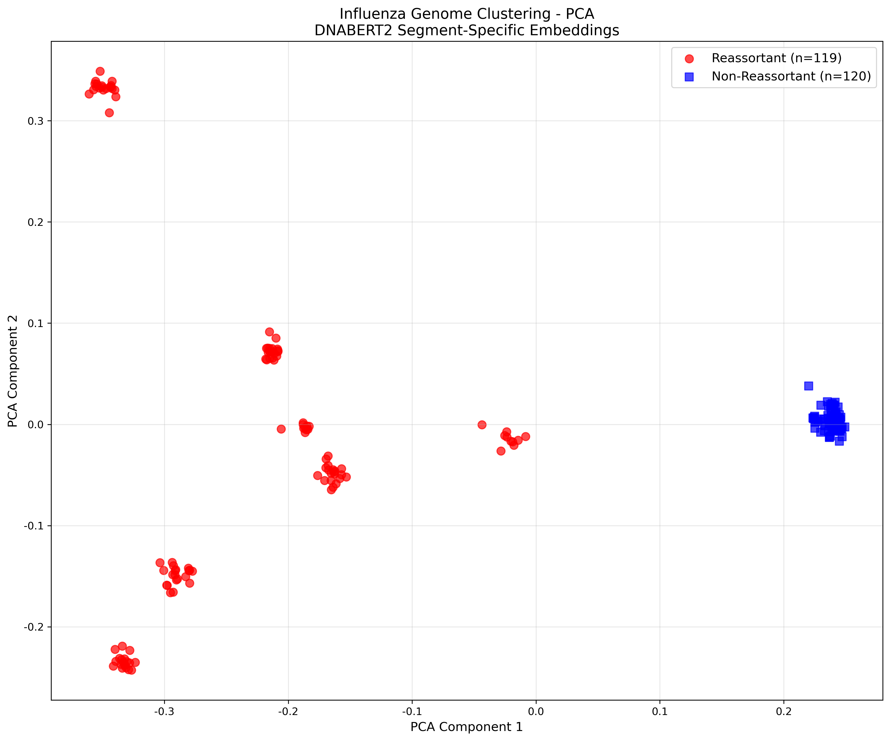

# Results

This folder summarizes the key outputs from the reassortment prediction framework, including DNABERT-2 embedding visualization, Random Forest classifier performance, genetic algorithm recovery of reassortant candidates, and GAT-based segment interaction analysis.

## Embedding Space Analysis

PCA and t-SNE were used to visualize the DNABERT-2-derived segment-specific embeddings from the training dataset.

PCA provides a linear, global view of the embedding space. The PCA plot shows a clear separation between reassortant and non-reassortant genomes, indicating that the strongest directions of variation in the embeddings already capture reassortment-associated structure.

t-SNE provides a nonlinear, local-neighborhood view. Compared with PCA, the t-SNE plot shows finer sub-clustering among reassortant genomes, suggesting that reassortants are not a single homogeneous group but may contain multiple genotype-specific or segment-combination-driven patterns.

Together, these visualizations indicate that DNABERT-2 segment-specific embeddings capture biologically meaningful genomic structure without task-specific fine-tuning: PCA highlights broad class-level separation, while t-SNE reveals local substructure within the reassortant class.

## Random Forest Classifier

The Random Forest classifier achieved strong performance on unseen same-study test data.

| Metric | Result |
|---|---:|
| Test samples | 55 |
| Reassortants correctly identified | 30 / 30 |
| Non-reassortants correctly identified | 25 / 25 |
| Accuracy | 100% |
| Mean prediction confidence | 0.96 |
